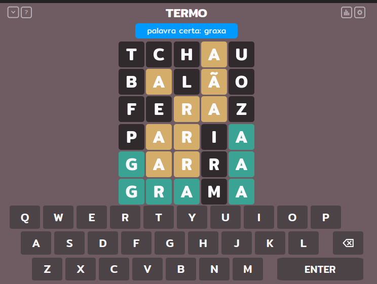
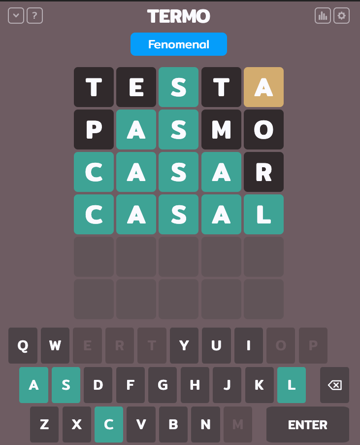
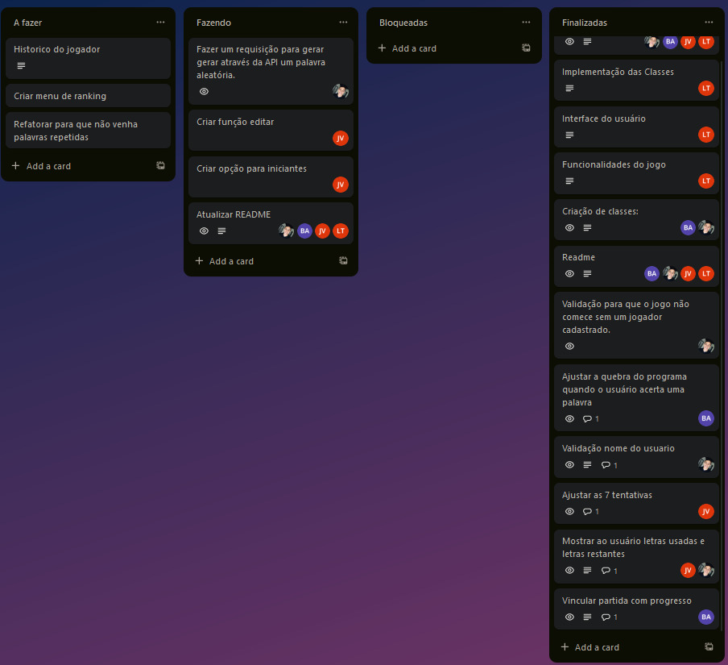
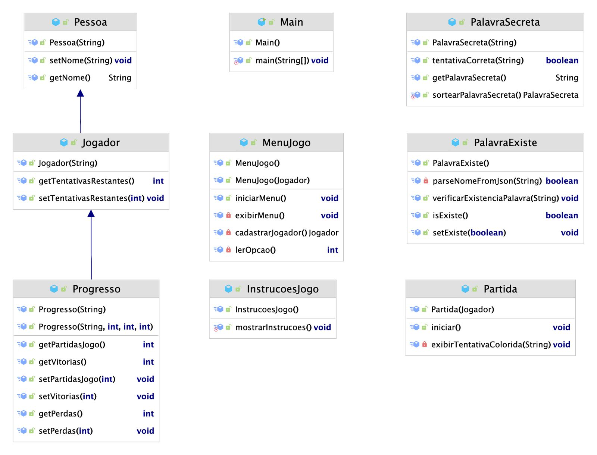

# **Sobre Jogo**


O projeto em questão tem como base o famoso jogo Termo, na qual possui o intuito de fazer com que o usuário, 
em um número reduzido de tentativas, tente adivinhar a palavra, oferencendo dicas pelas letras contidas nas palavras.

Termo é um jogo de palavras onde os jogadores tentam adivinhar uma palavra secreta de cinco letras. 
Cada jogador tem um número limitado de ***seis*** tentativas para descobrir a palavra correta. 

Após cada tentativa, o jogo fornece feedback sobre quais letras estão na posição correta ***geralmente destacadas 
em <span style="color: green;">VERDE</span>*** e quais letras estão na palavra, mas na posição errada 
***geralmente destacadas em <span style="color: red;">VERMELHO</span>***.
Letras que não estão na palavra são destacadas em ***<span style="color: gray;">CINZA</span>***. 

O objetivo é adivinhar a palavra secreta no menor número de tentativas possível.
O sistema foi desenvolvido para não aceitar palavras menores, maiores que cinco ou palavras inexistente no dicionário,
sendo assim, o jogador não perderá tentativas ao digitar uma palavra inválida.


</br>




## **Sobre Projeto**


Este projeto foi criado com o intuito de praticar tudo o que foi aprendido em sala de aula. Utilizamos Programação
Orientada a Objetos (POO) em Java para sua implementação além disso, implementamos uma funcionalidade de verificação
online da existência de palavras através de uma requisição HTTP. Utilizamos essa integração para validar se as palavras
digitadas pelo jogador estão presentes em um dicionário online em tempo real. O desenvolvimento foi realizado em grupo.

- [Mattheus Luiz](https://github.com/MattheusLuiz/);
- [Bruna ALmeida](https://github.com/bruna270498);
- [Ludmila](https://github.com/Ludmilact);
- [João Vitor](https://github.com/joaovxsantos);


### Trello


### Diagrama UML




## **Arquivos alterados para o desenvolvimento da segunda etapa:**

- Partida.java
- MenuJogo.java
- Teclado.java
- Partida.java
- Progresso.java

#### Fixes:

-   Corrigida a regra para criação do nome do jogador, que agora requer um mínimo de 3 letras e nenhum número.
-   Ajustado o contador de tentativas para funcionar corretamente durante o jogo.
-   Melhorias significativas nas informações fornecidas ao usuário durante a partida.
-   Ajuste na formatação do menu para melhor experiência do usuário.

#### Features:

-   **Teclado Virtual:** Implementação de um teclado virtual que altera as cores das letras conforme as palavras tentadas pelo jogador.
-   **Busca e Edição de Jogadores:** Funcionalidade para buscar e editar informações dos jogadores cadastrados.
-   **Ranking de Vitórias:** Sistema que mantém um ranking atualizado das vitórias dos jogadores registrados.
-   **Refinamento da Partida:** Melhorias na classe de partida e conexão de progresso com o jogo para uma experiência mais fluida.

#### Utilizações de Java Collections:

-   **[Classe Teclado](https://github.com/MattheusLuiz/vs14-back/blob/main/01-Java/task05/src/Model/Teclado.java):** Utilização de `HashSet` para armazenar teclas corretas e incorretas no teclado virtual.
-   **[Classe MenuJogo](https://github.com/MattheusLuiz/vs14-back/blob/main/01-Java/task05/src/MenuJogo.java):** Uso de `LinkedList` para gerenciar os jogadores cadastrados.
-   **[Classe PalavraSecreta](https://github.com/MattheusLuiz/vs14-back/blob/main/01-Java/task05/src/Model/PalavraSecreta.java):** Armazenamento de palavras em um `ArrayList`.

#### Utilização de Enums
-   **[Classe Cores](https://github.com/MattheusLuiz/vs14-back/blob/main/01-Java/task05/src/Service/Cores.java):** Utilização do `Enums` para implementação de cores no teclado virtual.

## **Como Executar**

 ```bash
 # clone o repositorio
 
- git clone git@github.com:MattheusLuiz/vs14-back.git

# abra o Intellij e entre na pasta

- vs14-back/01-Java/task05/src/Main.java

# Rode a classe

- Escolha sua opção no menu e aproveite o jogo.
```
