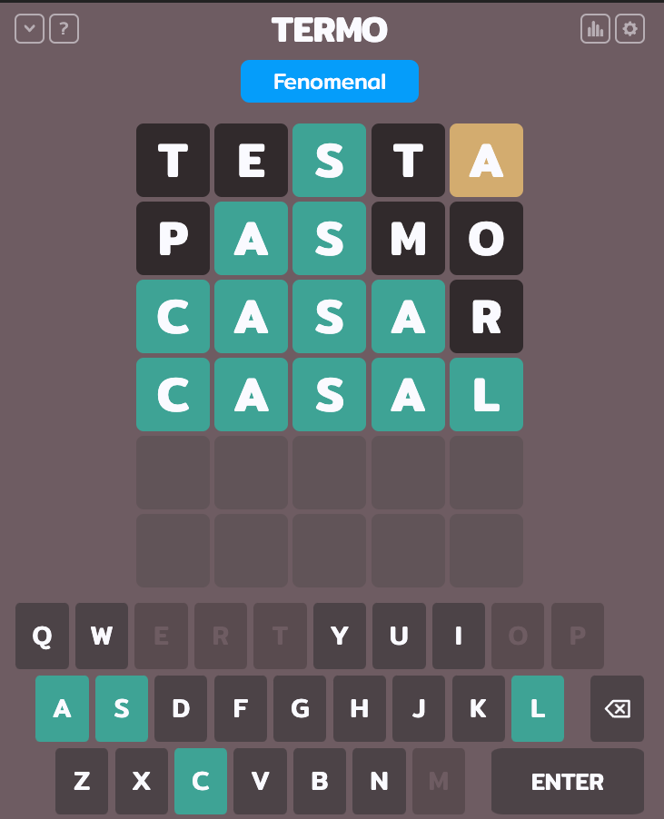
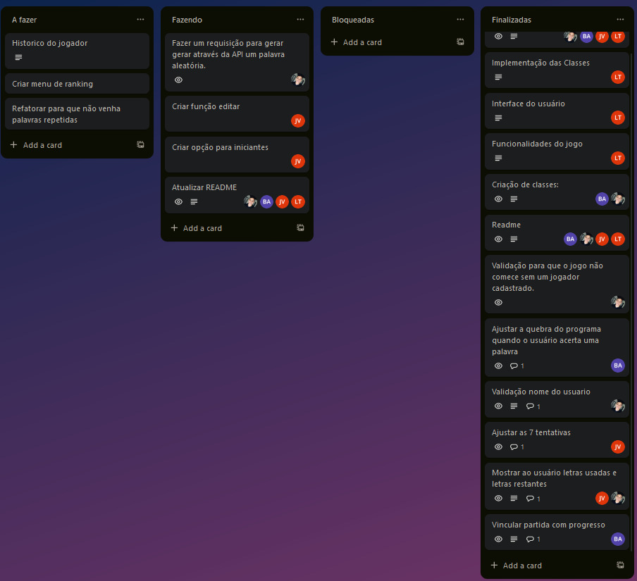
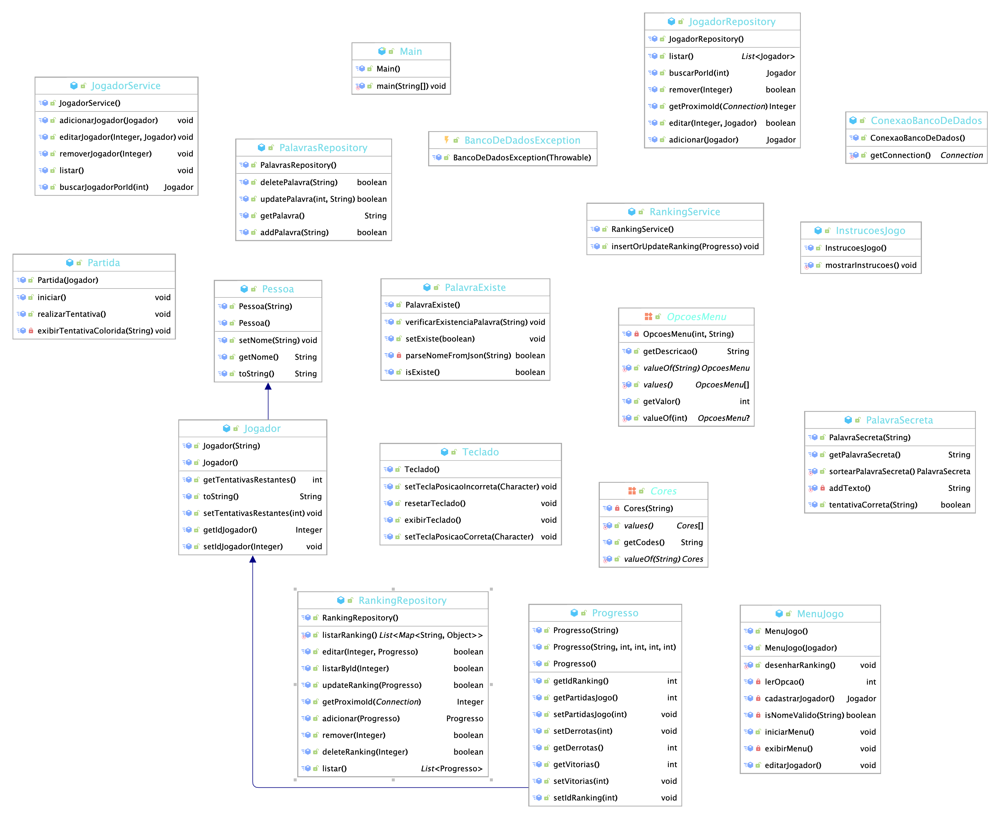
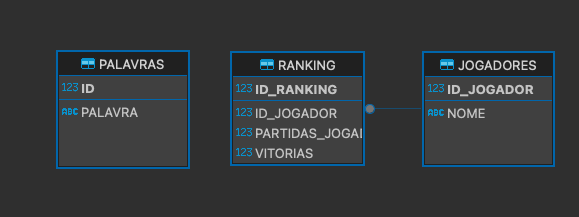

  


# **Sobre Jogo**


O projeto em questão tem como base o famoso jogo Termo, na qual possui o intuito de fazer com que o usuário,   
em um número reduzido de tentativas, tente adivinhar a palavra, oferencendo dicas pelas letras contidas nas palavras.

Termo é um jogo de palavras onde os jogadores tentam adivinhar uma palavra secreta de cinco letras.   
Cada jogador tem um número limitado de ***seis*** tentativas para descobrir a palavra correta.

Após cada tentativa, o jogo fornece feedback sobre quais letras estão na posição correta ***geralmente destacadas   
em <span style="color: green;">VERDE</span>*** e quais letras estão na palavra, mas na posição errada   
***geralmente destacadas em <span style="color: red;">VERMELHO</span>***.  
Letras que não estão na palavra são destacadas em ***<span style="color: gray;">CINZA</span>***.

O objetivo é adivinhar a palavra secreta no menor número de tentativas possível.  
O sistema foi desenvolvido para não aceitar palavras menores, maiores que cinco ou palavras inexistente no dicionário,  
sendo assim, o jogador não perderá tentativas ao digitar uma palavra inválida.


</br>  
  
  


## **Sobre Projeto**


Este projeto foi criado com o intuito de praticar tudo o que foi aprendido em sala de aula. Utilizamos Programação  
Orientada a Objetos (POO) em Java para sua implementação além disso, implementamos uma funcionalidade de verificação  
online da existência de palavras através de uma requisição HTTP. Utilizamos essa integração para validar se as palavras  
digitadas pelo jogador estão presentes em um dicionário online em tempo real. O desenvolvimento foi realizado em grupo.

- [Mattheus Luiz](https://github.com/MattheusLuiz/);
- [Bruna ALmeida](https://github.com/bruna270498);
- [Ludmila](https://github.com/Ludmilact);
- [João Vitor](https://github.com/joaovxsantos);


### Trello
  

### Diagrama UML

  

### Diagrama banco de dados
   
## **Arquivos alterados para o desenvolvimento da segunda etapa:**  

- Partida.java
- MenuJogo.java
- Teclado.java
- Partida.java
- Progresso.java

#### Fixes:

- Corrigida a regra para criação do nome do jogador, que agora requer um mínimo de 3 letras e nenhum número.
- Ajustado o contador de tentativas para funcionar corretamente durante o jogo.
- Melhorias significativas nas informações fornecidas ao usuário durante a partida.
- Ajuste na formatação do menu para melhor experiência do usuário.

#### Features:

-   **Teclado Virtual:** Implementação de um teclado virtual que altera as cores das letras conforme as palavras tentadas pelo jogador.
-   **Busca e Edição de Jogadores:** Funcionalidade para buscar e editar informações dos jogadores cadastrados.
-   **Ranking de Vitórias:** Sistema que mantém um ranking atualizado das vitórias dos jogadores registrados.
-   **Refinamento da Partida:** Melhorias na classe de partida e conexão de progresso com o jogo para uma experiência mais fluida.

#### Utilizações de Java Collections:

-   **[Classe Teclado](https://github.com/MattheusLuiz/vs14-back/blob/main/01-Java/task05/src/Model/Teclado.java):** Utilização de `HashSet` para armazenar teclas corretas e incorretas no teclado virtual.
-   **[Classe MenuJogo](https://github.com/MattheusLuiz/vs14-back/blob/main/01-Java/task05/src/MenuJogo.java):** Uso de `LinkedList` para gerenciar os jogadores cadastrados.
-   **[Classe PalavraSecreta](https://github.com/MattheusLuiz/vs14-back/blob/main/01-Java/task05/src/Model/PalavraSecreta.java):** Armazenamento de palavras em um `ArrayList`.

#### Utilização de Enums
-   **[Classe Cores](https://github.com/MattheusLuiz/vs14-back/blob/main/01-Java/task05/src/Service/Cores.java):** Utilização do `Enums` para implementação de cores no teclado virtual.

## **Como Executar**

 ```bash  
 # clone o repositorio  - git clone git@github.com:MattheusLuiz/vs14-back.git  
  
# abra o Intellij e entre na pasta  
  
- vs14-back/01-Java/task05/src/Main.java  
  
# Rode a classe  
  
- Escolha sua opção no menu e aproveite o jogo.  
```  

## Projeto Java com Banco de Dados Oracle em Docker

Este projeto é uma aplicação Java que utiliza um banco de dados Oracle rodando em um container Docker. A seguir, você encontrará as instruções necessárias para configurar e executar o projeto em seu ambiente.

## 1. Pré-requisitos para execução do projeto

Antes de iniciar, certifique-se de que você tem os seguintes pré-requisitos instalados em seu sistema:

- Java JDK 11 ou superior
- Docker para rodar o banco de dados Oracle em um container
- Git para clonar o repositório do projeto (opcional)

## 2. Guia de Instalação

### Configurando o Banco de Dados Oracle
Baixar a Imagem do Oracle Database: Primeiro, será necessário baixar a imagem do Oracle Database para Docker.

```bash docker run -d --name bd-oracle -p 1521:1521 --restart=unless-stopped -e ORACLE_ALLOW_REMOTE=true -e ORACLE_PASSWORD=oracle -e RELAX_SECURITY=1  -v bd-oracle:/u01/app/oracle  epiclabs/docker-oracle-xe-11g  
```  

### Conectar a aplicação ao Banco de Dados Oracle

Para conectar seu projeto Java ao banco de dados Oracle, siga os passos abaixo:

1. **Adicione o Driver JDBC do Oracle ao seu projeto**: Certifique-se de que o driver JDBC do Oracle (`ojdbc.jar`) está adicionado ao classpath do seu projeto.

**Configuração do Data Source:**

- No IntelliJ IDEA, vá para `View` -> `Tool Windows` -> `Database`.
- Clique no ícone de "+" e selecione `Data Source` -> `Oracle`.
- Preencha os detalhes necessários como nome do host, porta, nome do banco de dados, nome de usuário e senha.

**Conexão e Execução de Consultas:**

- Após configurar o Data Source, você pode testar a conexão clicando com o botão direito no Data Source e selecionando `Connect`.

### Executar Queries para Criação de Tabelas

Para criar as tabelas necessárias no banco de dados da aplicação, siga os passos abaixo:

***JOGADOR / RANKING/ PALAVRA***

1. **Arquivo de Script SQL**: Utilize o arquivo `src/bd/createandinsert.sql`

2. **Como Executar**: Você pode executar essas queries diretamente no DBeaver, conectando-se ao seu banco de dados Oracle, ou utilizando ferramentas de linha de comando como SQL*Plus.

- O conteúdo do arquivo createandinsert.sql cria uma tabela para JOGADORES, uma para RANKING e outra para PALAVRA e uma sequência jogador_seq, ranking_seq e seq_palavras_id além de tentar remover a sequência se ela já existir, tratando o erro caso a sequência não exista. Isso prepara o banco de dados para armazenar informações sobre jogadores, com um ID único gerado pela sequência para cada novo jogador.

# Documentação do Fluxo do Projeto Jogo Termo

Este documento descreve o fluxo de dados e interações entre as camadas do projeto Jogo Termo, desde a entrada de dados pelo usuário até a persistência dos dados no repositório.

## Fluxo Geral

1. **Camada de Entrada de Dados (`MenuJogo`)**: Esta é a primeira camada de interação com o usuário, onde ele pode escolher entre diversas opções como jogar, ver o ranking, cadastrar ou editar um jogador.

2. **Camada de Serviço**: Após a escolha do usuário, a requisição é passada para a camada de serviço, que contém a lógica de negócios do jogo. Esta camada é responsável por processar a ação escolhida pelo usuário e, se necessário, interagir com a camada de repositório para persistir ou recuperar dados.

3. **Camada de Repositório**: A última camada é responsável pela comunicação com o banco de dados ou qualquer outra forma de persistência de dados. Aqui, os dados dos jogadores, partidas e progressos são salvos ou recuperados conforme necessário.

## Detalhes do Fluxo

### 1. Camada de Entrada de Dados (`MenuJogo`)

- O usuário interage com o menu do jogo, escolhendo uma opção.
- O método `iniciarMenu()` captura a escolha do usuário e direciona para a ação correspondente.
- Para ações que envolvem dados (como cadastrar jogador ou iniciar partida), a camada de serviço correspondente é chamada.

### 2. Camada de Serviço

- **JogadorService**: Gerencia as operações relacionadas aos jogadores, como adicionar, editar ou remover um jogador.
- **PartidaService**: Controla o fluxo de uma partida, desde o início até o fim, incluindo verificar tentativas e determinar o resultado da partida.
- **ProgressoService**: Calcula e armazena o progresso dos jogadores, como vitórias e derrotas.

### 3. Camada de Repositório

- **JogadorRepository**: Responsável por operações de persistência relacionadas aos jogadores, como salvar um novo jogador ou atualizar informações de um jogador existente.
- **RankingRepository**: Gerencia a persistência de dados relacionados às partidas, incluindo salvar os resultados de cada partida, vitórias e derrotas.
- **PalavraRepository**: Responsável por operações de persistência relacionadas as palavras, como salvar uma nova palavra, atualizar uma palavra, deletar uma palavra e recuperar uma palavra do banco de dados.